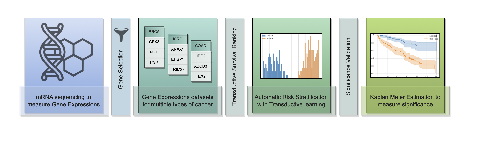

# A Transductive Approach to Survival Ranking for Cancer Risk Stratification
### Ethar Alzaid, Muhammad Dawood* and Fayyaz Minhas
### Tissue Image Analytics Center, University of Warwick, United Kingdom

This repository contains the code for the following manuscript:

A Transductive Approach to Survival Ranking for Cancer Risk Stratification, submitted to The 18th Machine Learning in Computational Biology (MLCB2023) for review.

## Introduction
How can we stratify patients into subgroups based on their expected survival in a purely data-driven manner? Identifying cancer patients at higher risk is crucial in planning personalized treatment to improve patient survival outcomes. The main challenge with existing approaches is the underlying complexity of handling censoring in the survival data and manually setting a precise threshold to stratify patients into risk groups. In this paper, a Transductive Survival Ranking (TSR) model for patient risk stratification is proposed. The model handles samples in pairs to make use of instances with censored survival information. It incorporates unlabeled test samples in the training process to maximize the margin between their predicted survival scores resulting in automatic patient stratification into subgroups without the need for any additional post-processing or manual threshold selection. The model was evaluated on several datasets with varying sets of covariates, and all stratification were significant (p <<0.05) with high concordance indices of up to 0.78 in Disease Specific Survival and 0.75 in Overall Survival.

## Dependencies

lifelines==0.27.7  
matplotlib==3.5.3
numpy==1.21.6
pandas==1.3.5
pynverse==0.1.4.6
pysurvival==0.1.2
scikit-learn==1.0.2
scipy==1.7.3
seaborn==0.12.2
torch==1.13.1
tqdm==4.65.0
umap==0.1.1
wrapt==1.15.0

Python Version== 3.7.16

## Usage
### Step 1. Data download
A sample file for BRCA is included in the Dataset folder with a separate file for survival information.
This was downloaded from TCGA on cBioPortal (https://www.cbioportal.org/).

### Step 2. Data processing
